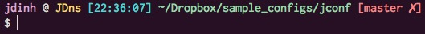
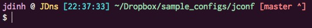
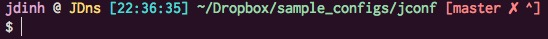

JD's bash

## usage

```
curl https://raw.githubusercontent.com/jdinhlife/jconf/master/.jbash | bash ; source ~/.bash_profile
```

## What does this do?

 * provide a little enhancement for working with git (see examples)

 * provide a few aliases that might be useful

   ```
   alias x="exit"
   alias gs="git status"
   alias gsh="git show"
   alias gd="git diff"
   alias gb='git branch'
   alias gc='git commit'
   alias gcam='git commit -a -m'
   alias go='git checkout '
   alias gk='gitk --all&'
   alias gx='gitx --all'
   alias gl='git pull'
   alias gp='git push'
   alias ll="ls -lhG"
   alias la="ls -laG"
   alias rm="trash"
   alias gh="git hist"
   ```

## Dependencies
### Powerline fonts
In order for the icons to display properly, a `powerline` font is needed.

[https://github.com/powerline/fonts](https://github.com/powerline/fonts)

Try `Inconsolata` or `DejaVu Sans Mono`

### git (OSX)
If it's not working (as in the examples), it's possibly because you're using OSX's git which is an old version. Try installing a new one via [brew.sh](http://brew.sh/):

`brew install git`

### trash cli
`rm` will be aliased to `trash` which will move the files/folders to Trash bin (OSX) instead of permanently deleted. `ptrash` on CentOS would behave similarly.

Install `trash`:

 * OSX: `brew install trash`
 * CentOS: `ptrash` (remember to change `rm` to map to `ptrash` in `.bash_aliases` after installing)

## Examples
### dirty


### stashed


### stashed & dirty

